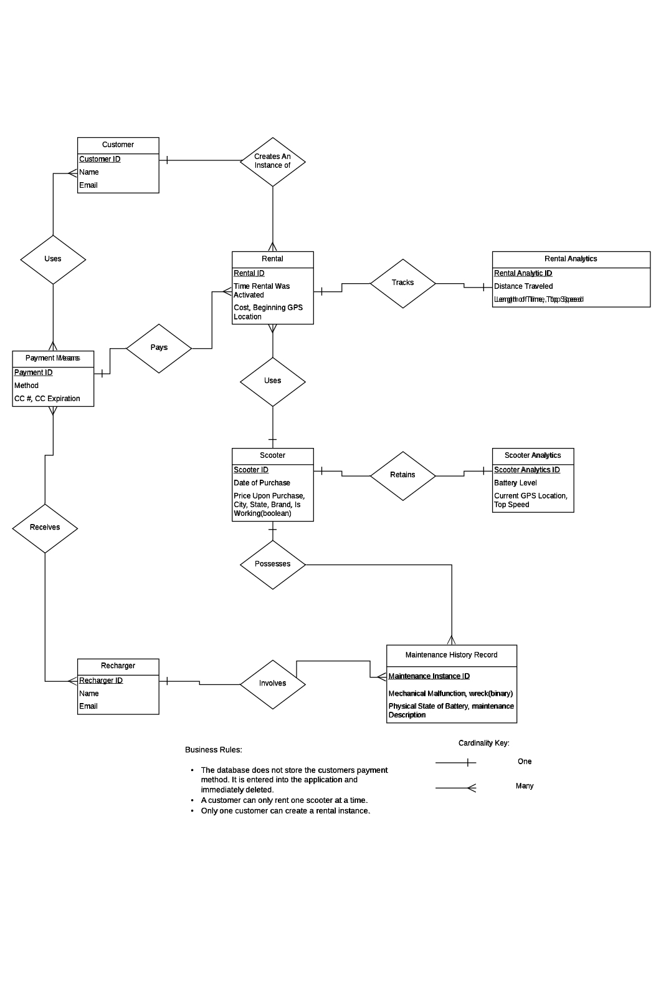
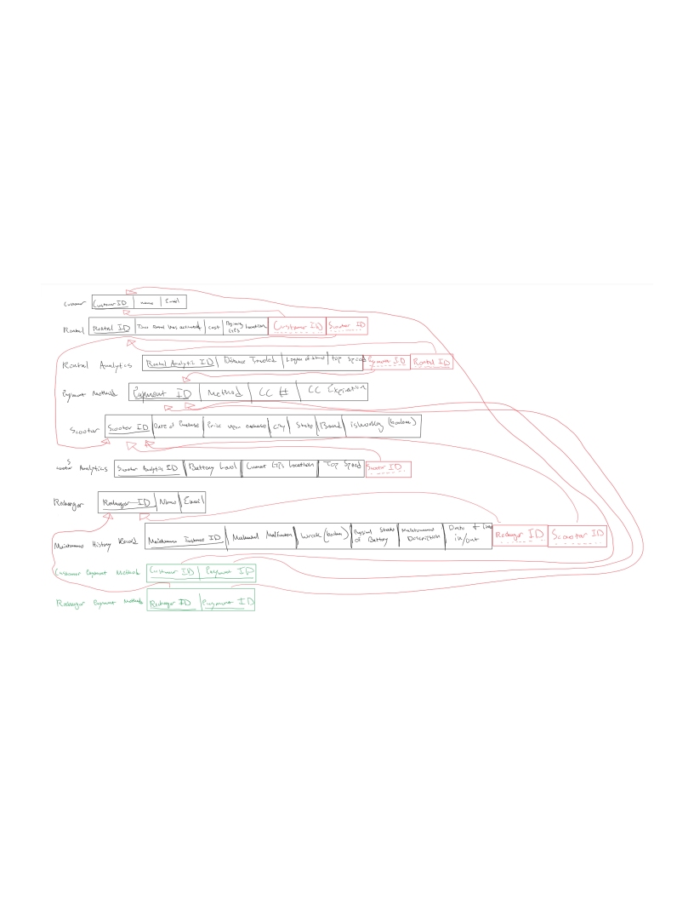

# Database Theory and Applications - St. Edwards Univesity - Fall 2017
#### Database Design and Development for a mobile scooter rent company

Tech Stack: 
DB: mySQL,
Frontend:HTML,
Backend:PHP,
# Overview
The	company	"Incredibly	Reliable	Scooters"	rents	electric	scooters	to	
customers	over	a	mobile	application.	The	scooters	are	available	to	rent	
around	the	city	to	be	activated	at	the	location	by	the	customer.	The	
scooters	are	tracked	by	GPS	.	In	order	to	recharge	the	scooters	employees	
are	hired	through	the	application	as	"Rechargers."	A	"Rechargers"	
responsibility	is	to	retrieve	the	scooter,	recharge	the	scooter's	batteries,	
perform	maintenance	on	the	scooter,	and	then	place	the	scooter	at	the	
designated	location	on	the	application.				
Goals:	
	 Incredibly	Reliable	Scooters	is	creating	a	database	in	order	to	keep	
track	of	information	in	order	to	make	informed	business	decisions.	These	
decisions	are	motivated	to	better	understand	how	to	avoid	risks	to	
customer,	a	reliable	understanding	of	their	inventory,	and	a	growing	
knowledge	of	how	the	scooters	are	being	used.		
Capabilities:	
	 The	database	must	keep	track	of	customers,	the	customers	payment	
method,	the	company’s	payment	method,	a	rental	of	a	scooter,	analytics	of	
a	rental	instance,	the	entirety	of	the	scooter	inventory,	analytics	on	each	
individual	scooter,	the	scooter	maintenance	history	of	each	scooter,	and	the	
Rechargers.		
Features:	
	 For	the	Analytics	of	a	Rental	Instance	Incredibly	Reliable	Scooters	
wants	to	keep	track	of	the	distance	traveled,	length	of	time	used,	and	the	
top	speed	achieved.		
	 For	the	Analytics	of	a	scooter	Incredibly	Reliable	Scooters	wants	to	
keep	track	of	the	battery	level,	current	GPS	location,	and	top	speed.	
									A	scooter	maintenance	history	record	is	created	upon	an	instance	of	a	
scooter	performing	his	recharging	and	maintenance	duties.	Within	the	
scooter	maintenance	history	record	the	company	would	like	to	keep	track	
if	a	mechanical	malfunction	happened,	if	the	scooter	was	involved	in	a	
wreck,	the	physical	state	of	the	battery,	and	a	description	of	the	
maintenance	performed.		
*in	deployment:	amount	of	time	the	scooter	was	rented	or	available	to	rent.	
Does	not	include	when	a	scooter	is	in	service(maintenance).			

# Database Entity Relationship Diagram: 

# Database Relational Schema:


# Table Creation from Commmand Line:

```
create table Customer
    (Customer_ID int auto_increment not null,
    name varchar(15),
    email varchar(30),
    primary key(Customer_ID)) Engine=InnoDB;
    
create table Payment_Method
    (Payment_ID int auto_increment not null,
    method varchar(20),
    credit_card_number varchar(20),
    credit_card_expiration TIME,
    primary key(Payment_ID))Engine=InnoDB;
    
create table Scooter
    (scooter_id int auto_increment not null,
    Date_of_Purchase DATE, 
    price_upon_purchase numeric(5,0),
    city varchar(25),
    state varchar(25),
    brand varchar(25),
    working_status boolean,
    primary key(scooter_id))Engine=InnoDB;
    
create table Recharger
    (Recharger_ID int auto_increment not null,
    name varchar(25),
    email varchar(30),
    primary key(Recharger_ID))Engine=InnoDB;
    
create table rental
    (Rental_ID int auto_increment not null,
    rentalActivationTime TIMESTAMP,
    cost numeric(5,0),
    beginning_GPS_Location varchar(20),
    scooter_id int,
    Customer_ID int,
    primary key (Rental_ID),
    foreign key (Customer_ID) references Customer (Customer_ID),
    foreign key( scooter_id) references Scooter (scooter_id))Engine=InnoDB;
    
create table Rental_Analytics
    (Rental_Analytics_ID int auto_increment not null,
    distance_traveled int,
    length_of_time_used time,
    top_speed int,
    Payment_ID int,
    Rental_ID int,
    primary key(Rental_Analytics_ID),
    foreign key(Payment_ID) references Payment_Method (Payment_ID),
    foreign key(Rental_ID) references rental (Rental_ID))Engine=InnoDB;

create table Scooter_Analytics
    (scooter_analytics_id int auto_increment not null,
    battery_level int,
    current_GPS_Location varchar(20),
    top_speed int,
    scooter_id int,
    primary key(scooter_analytics_id),
    foreign key(scooter_id) references Scooter(scooter_id) on delete set null)Engine=InnoDB;

create table Maintenance_History_Record
    (Maintenance_Instance_ID int auto_increment not null,
    Mechanical_Malfunction boolean,
    wreck boolean,
    physical_state_of_battery varchar(30),
    maintenance_description varchar(30),
    Recharger_ID int,
    Scooter_ID int,
    primary key(Maintenance_Instance_ID),
    foreign key(Recharger_ID) references Recharger(Recharger_ID) on delete set null,
    foreign key(Scooter_ID) references Scooter(Scooter_ID) on delete set null)Engine=InnoDB;

create table customer_payment_method
    (Customer_ID int,
    Payment_ID int,
    primary key (Customer_ID,Payment_ID),
    foreign key(Customer_ID) references Customer(Customer_ID),
    foreign key(Payment_ID) references Payment_Method(Payment_ID))Engine=InnoDB;

create table recharger_payment_method
    (Recharger_ID int,
    Payment_ID int,
    primary key (Recharger_ID, Payment_ID),
    foreign key(Recharger_ID) references Recharger(Recharger_ID),
    foreign key(Payment_ID) references Payment_Method(Payment_ID))Engine=InnoDB;
```


